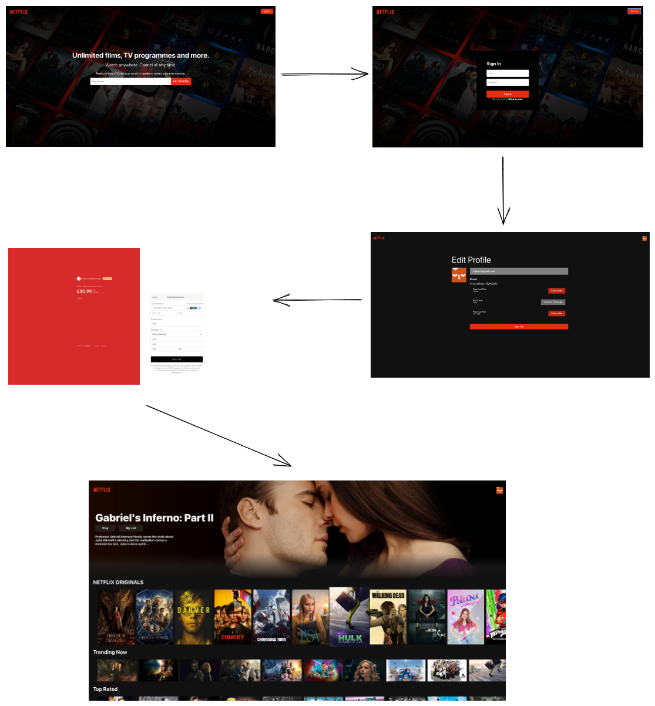
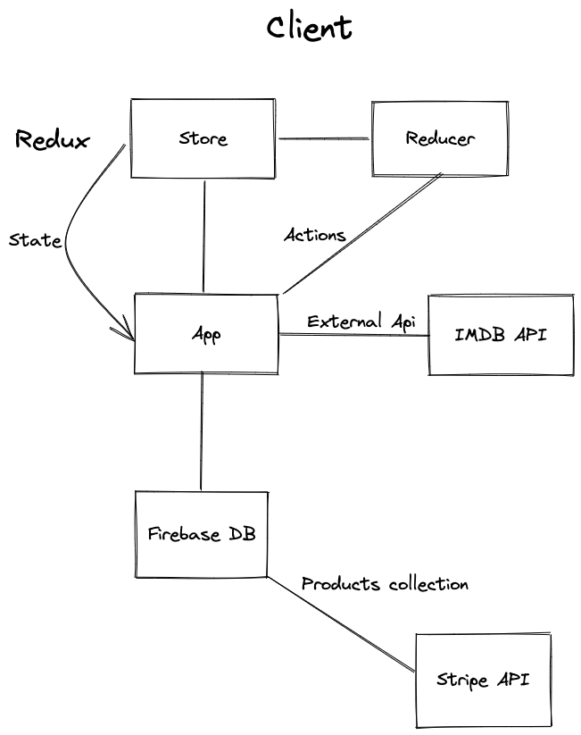

# Netflix 2.0 - React

- React
- Redux
- Firebase DB
- Stripe Payment
- Google Auth
- Version Control - (Git)
- TMDB API

### Program preview



## Specification

### User Story

```
As a user I would like to create a Netflix account and see a list of
susbcriptions avaialble to me.

As a user I would like to select a subscription best suited for me.

As a user I would like to see a list of programs available to me.

```

### Design




```javascript

```

Expected behavior

```javascript

```

### Requirements

## Installation

1. Clone Repository

```sh
git clone https://github.com/BrijeshPujara/Netflix-2.0-React.git
```

2. Install dependencies

```sh
npm install
```

3. Run tests

```sh
npm run test
```

## Self-assessment

Once you have completed the challenge and feel happy with your solution, here's a form to help you reflect on the quality of your code: https://docs.google.com/forms/d/1Q-NnqVObbGLDHxlvbUfeAC7yBCf3eCjTmz6GOqC9Aeo/edit

<!-- BEGIN GENERATED SECTION DO NOT EDIT -->

---

**How was this resource?**  
[😫](https://airtable.com/shrUJ3t7KLMqVRFKR?prefill_Repository=makersacademy/course&prefill_File=individual_challenges/bank_tech_test.md&prefill_Sentiment=😫) [😕](https://airtable.com/shrUJ3t7KLMqVRFKR?prefill_Repository=makersacademy/course&prefill_File=individual_challenges/bank_tech_test.md&prefill_Sentiment=😕) [😐](https://airtable.com/shrUJ3t7KLMqVRFKR?prefill_Repository=makersacademy/course&prefill_File=individual_challenges/bank_tech_test.md&prefill_Sentiment=😐) [🙂](https://airtable.com/shrUJ3t7KLMqVRFKR?prefill_Repository=makersacademy/course&prefill_File=individual_challenges/bank_tech_test.md&prefill_Sentiment=🙂) [😀](https://airtable.com/shrUJ3t7KLMqVRFKR?prefill_Repository=makersacademy/course&prefill_File=individual_challenges/bank_tech_test.md&prefill_Sentiment=😀)  
Click an emoji to tell us.

<!-- END GENERATED SECTION DO NOT EDIT -->
